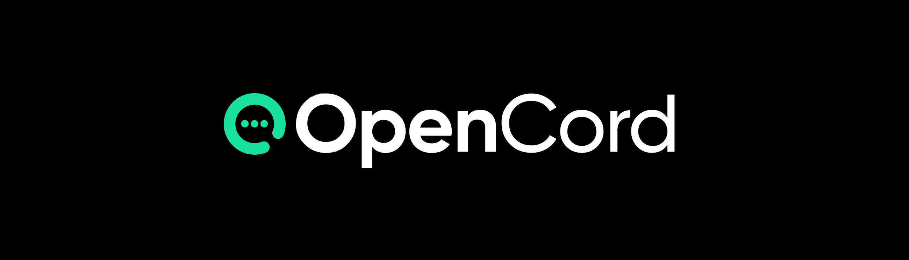

<h1 style="text-align: center; padding: 2rem 3rem 3rem 3rem;">A censor-free, discord-like web app based on the Nostr Protocol.</h1>

    <h2>👀 Currently working on</h2>

- [ ] IndexedDB (Dexie.js)
- [ ] Login Functionality

---

    <h2>🤔 Features planned</h2>

- [ ] Direct Messages (Encrypted)
- [ ] Public & Private Group Chats (Channels)
- [ ] Contacts
- [ ] Send Images
- [ ] Link Previews
- [ ] Profile Bio
- [ ] Channel Permissions
- [ ] Search
- [ ] Notifications

